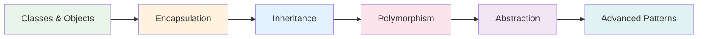
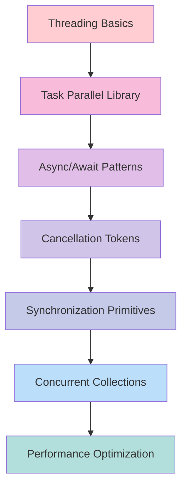
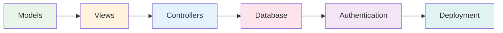
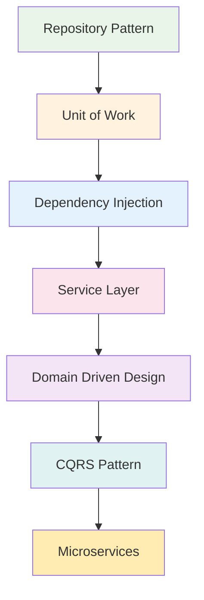

<div align="center">

# Formulatrix Software Development Bootcamp


<br>


<br>

[](https://github.com/akmalfaditya/Bootcamp/stargazers)
[](https://github.com/akmalfaditya/Bootcamp/network/members)
[](https://github.com/akmalfaditya/Bootcamp/issues)
[](https://github.com/akmalfaditya/Bootcamp/graphs/contributors)

<br>

<h3>Transform from Zero to Hero in Software Development</h3>
<p><em>A comprehensive, hands-on journey from C# fundamentals to enterprise-level web applications</em></p>

<div align="center">
  <a href="#quick-start">
    
  </a>
  <a href="#interactive-learning-path">
    
  </a>
  <a href="#featured-projects">
    
  </a>
  <a href="#community">
    
  </a>
</div>

</div>

---

## What Makes This Bootcamp Special?

<table>
<tr>
<td width="33%" align="center">
<div style="background: linear-gradient(135deg, #667eea 0%, #764ba2 100%); padding: 20px; border-radius: 15px; color: white;">

<h3>Project-Based Learning</h3>
<p>Build real-world applications that enhance your portfolio while mastering concepts through practical implementation</p>
</div>
</td>
<td width="33%" align="center">
<div style="background: linear-gradient(135deg, #f093fb 0%, #f5576c 100%); padding: 20px; border-radius: 15px; color: white;">

<h3>Progressive Curriculum</h3>
<p>Carefully structured learning path from fundamentals to advanced enterprise-level development patterns</p>
</div>
</td>
<td width="33%" align="center">
<div style="background: linear-gradient(135deg, #4facfe 0%, #00f2fe 100%); padding: 20px; border-radius: 15px; color: white;">

<h3>Industry-Ready Skills</h3>
<p>Learn technologies and practices used in modern software development teams and enterprise environments</p>
</div>
</td>
</tr>
</table>

### Learning Statistics

<div align="center">

| Metric | Value | Description |
|--------|-------|-------------|
| **Total Projects** |  | Hands-on coding exercises |
| **Learning Hours** |  | Comprehensive curriculum |
| **Skill Level** |  | Complete learning journey |
| **Industry Focus** |  | Production-grade practices |

</div>


## Repository Structure

<div align="center">

### Interactive Repository Explorer


</div>

<details>
<summary><strong>Complete Repository Architecture</strong> - Click to navigate the codebase</summary>

<br>

```
Bootcamp/
├── Practice/                    # Core Learning Modules
│   ├── C# Language Basics/      # │ Syntax, Variables, Control Flow
│   │   ├── Syntax/                 # │ └─ Language fundamentals
│   │   ├── Variables/              # │ └─ Data types and storage
│   │   └── Control Flow/           # │ └─ Program logic patterns
│   │
│   ├── Creating Types/           # │ Object-Oriented Programming
│   │   ├── Classes/                # │ ├─ Object blueprints
│   │   ├── Inheritance/            # │ ├─ Code reuse patterns
│   │   └── Generics/               # │ └─ Type-safe collections
│   │
│   ├── Framework Fundamentals/   # │ .NET Core Mastery
│   │   ├── Numbers & Math/         # │ ├─ Numeric operations
│   │   ├── Dates & Times/          # │ ├─ Temporal data handling
│   │   └── Text Processing/        # │ └─ String manipulation
│   │
│   ├── Collections/             # │ Data Structures & Algorithms
│   │   ├── Lists & Arrays/         # │ ├─ Sequential containers
│   │   ├── Dictionaries/           # │ ├─ Key-value mappings
│   │   └── Custom Collections/     # │ └─ Specialized containers
│   │
│   ├── Concurrency/            # │ Async & Parallel Programming
│   │   ├── Threading/              # │ ├─ Multi-threaded execution
│   │   ├── Async Patterns/         # │ ├─ Non-blocking operations
│   │   └── Task Management/        # │ └─ Concurrent workflows
│   │
│   └── Advanced Features/       # │ Modern C# Capabilities
│       ├── LINQ/                   # │ ├─ Query expressions
│       ├── Delegates & Events/     # │ ├─ Functional programming
│       └── Reflection/             # │ └─ Runtime type inspection
│
├── Batch-13/                   # Intensive Training Sessions
│   ├── Day 1-9/                # │ OOP Excellence
│   │   ├── Project Architecture/   # │ ├─ Design principles
│   │   ├── Class Design/           # │ ├─ Object modeling
│   │   └── Composition Patterns/   # │ └─ Relationship modeling
│   │
│   ├── Day 15-17/              # │ Advanced Language Features
│   │   ├── Exception Handling/     # │ ├─ Error management
│   │   ├── Memory Management/      # │ ├─ Performance optimization
│   │   └── Compiler Features/      # │ └─ Language internals
│   │
│   ├── Day 20-21/              # │ Concurrent Programming
│   │   ├── Multi-threading/        # │ ├─ Parallel execution
│   │   ├── Async Operations/       # │ ├─ Asynchronous patterns
│   │   └── File I/O/               # │ └─ System interactions
│   │
│   └── Day 22-26/              # │ Professional Standards
│       ├── SOLID Principles/       # │ ├─ Design methodologies
│       ├── Design Patterns/        # │ ├─ Proven solutions
│       └── Enterprise Projects/    # │ └─ Production-ready code
│
├── MVC/                        # Web Application Development
│   └── BloggieMVC/             # │ Full-Stack Blog Platform
│       ├── Models/                 # │ ├─ Data representation
│       ├── Views/                  # │ ├─ User interface
│       ├── Controllers/            # │ ├─ Business logic
│       └── Database/               # │ └─ Data persistence
│
├── API/                        # Web Service Development
│   └── NZWalks-Solution/       # │ RESTful API Implementation
│       ├── Controllers/            # │ ├─ HTTP endpoints
│       ├── Models/                 # │ ├─ Data transfer objects
│       ├── Services/               # │ ├─ Business services
│       └── Database/               # │ └─ Entity Framework
│
└── README.md                   # Interactive Documentation
```

<div align="center">

### Quick Navigation

<a href="Practice/">
  
</a>
<a href="Batch-13/">
  
</a>
<a href="MVC/">
  
</a>
<a href="API/">
  
</a>

</div>

</details>

---

## Interactive Learning Path

<div align="center">

### Choose Your Learning Journey


</div>

<table>
<tr>
<td width="33%" align="center">
<div style="border: 3px solid #4CAF50; border-radius: 15px; padding: 20px; background: linear-gradient(135deg, #C8E6C9, #E8F5E8);">

### **BEGINNER**


**New to Programming?**  
Start your coding adventure here!

<div style="margin: 15px 0;">
<strong>What You'll Learn:</strong><br>
✓ C# Syntax & Fundamentals<br>
✓ Object-Oriented Programming<br>
✓ Problem-Solving Skills<br>
✓ Development Best Practices
</div>

<div style="margin: 15px 0;">
<strong>Time Investment:</strong><br>
4-6 weeks of dedicated learning
</div>

<a href="#phase-1-fundamentals">

</a>

</div>
</td>

<td width="33%" align="center">
<div style="border: 3px solid #FF9800; border-radius: 15px; padding: 20px; background: linear-gradient(135deg, #FFE0B2, #FFF3E0);">

### **INTERMEDIATE**


**Know Basic C#?**  
Advance to professional topics!

<div style="margin: 15px 0;">
<strong>What You'll Master:</strong><br>
✓ Advanced C# Features<br>
✓ Design Patterns<br>
✓ Concurrent Programming<br>
✓ Framework Deep Dive
</div>

<div style="margin: 15px 0;">
<strong>Time Investment:</strong><br>
6-8 weeks of intensive practice
</div>

<a href="#phase-2-intensive-training">

</a>

</div>
</td>

<td width="33%" align="center">
<div style="border: 3px solid #F44336; border-radius: 15px; padding: 20px; background: linear-gradient(135deg, #FFCDD2, #FFEBEE);">

### **ADVANCED**


**Ready for Production?**  
Build enterprise applications!

<div style="margin: 15px 0;">
<strong>What You'll Build:</strong><br>
✓ Full-Stack Web Apps<br>
✓ RESTful APIs<br>
✓ Database Integration<br>
✓ Cloud-Ready Solutions
</div>

<div style="margin: 15px 0;">
<strong>Time Investment:</strong><br>
8-10 weeks of project development
</div>

<a href="#phase-3-web-development">

</a>

</div>
</td>
</tr>
</table>

<div align="center">

### Learning Progress Tracker


<br><br>

**Track your journey through our comprehensive curriculum**

</div>

---

## Phase 1: Fundamentals

<div align="center">

### Master the Building Blocks of Programming


<br>

**Build unshakeable foundations in C# programming and software development principles**

</div>

<br>

### C# Language Basics

<details>
<summary><strong>Core Language Concepts</strong> - Essential programming fundamentals</summary>

<br>

<div align="center">

#### Interactive Learning Modules

</div>

| Module | Complexity | Duration | Hands-on Projects | Quick Access |
|-----------|---------------|-------------|---------------------|------------------|
| **Syntax & Structure** |  | 3-5 hours | Variable playground, Calculator basics | [Explore](Practice/C%23%20Language%20Basics/) |
| **Variables & Data Types** |  | 4-6 hours | Type conversion lab, Data validator | [Explore](Practice/C%23%20Language%20Basics/) |
| **Control Flow** |  | 6-8 hours | Decision tree builder, Loop challenges | [Explore](Practice/C%23%20Language%20Basics/) |
| **Methods & Functions** |  | 5-7 hours | Function factory, Recursion exercises | [Explore](Practice/C%23%20Language%20Basics/) |
| **String Operations** |  | 4-5 hours | Text processor, String analyzer | [Explore](Practice/C%23%20Language%20Basics/) |
| **Arrays & Collections** |  | 6-8 hours | Data structure simulator, Collection manager | [Explore](Practice/C%23%20Language%20Basics/) |

<div align="center">

#### Progress Tracking


<br>

**Pro Tip:** Complete each module's hands-on projects before moving to the next level!

</div>

<div align="center">

#### Learning Objectives Checklist

</div>

- [ ] **Syntax Mastery**: Write clean, readable C# code following conventions
- [ ] **Type System**: Understand value types, reference types, and conversions  
- [ ] **Logic Implementation**: Build complex decision trees and iteration patterns
- [ ] **Function Design**: Create reusable, modular code components
- [ ] **Data Manipulation**: Process and transform text and numeric data
- [ ] **Collection Handling**: Manage dynamic data structures efficiently

</details>

<br>

### Object-Oriented Programming

<details>
<summary><strong>Create Professional Software Architecture</strong> - Master OOP principles</summary>

<br>

<div align="center">

#### OOP Learning Roadmap



</div>

| OOP Concept | Theory | Practice | Interactive Challenge | Mastery Project |
|----------------|-----------|-------------|-------------------------|-------------------|
| **Classes & Objects** | Object blueprints and instantiation | Student, Car, Bank Account classes | Object factory simulator | Personal portfolio tracker |
| **Encapsulation** | Data hiding and access control | Property implementation exercises | Access modifier playground | Secure data validator |
| **Inheritance** | Code reuse through "is-a" relationships | Animal hierarchy, Vehicle types | Inheritance tree builder | Shape geometry system |
| **Polymorphism** | Method overriding and interface contracts | Virtual methods, abstract classes | Behavior modifier lab | Plugin architecture demo |
| **Abstraction** | Interface design and implementation | Repository patterns, service layers | Interface designer tool | Modular application framework |

<div align="center">

#### OOP Mastery Tracker


<br>

**Milestone Rewards:** Unlock advanced projects as you master each concept!

</div>

</details>

<br>

### Framework Fundamentals

<details>
<summary><strong>.NET Core Deep Dive</strong> - Platform mastery and advanced features</summary>

<br>

<div align="center">

#### Framework Learning Matrix

</div>

<table>
<tr>
<td width="33%" align="center">
<h4>Numbers & Math</h4>
<ul align="left">
<li>Numeric precision handling</li>
<li>Mathematical operations</li>
<li>Type conversions</li>
<li>Performance optimization</li>
</ul>
<a href="Practice/Framework%20Fundamentals/">

</a>
</td>
<td width="33%" align="center">
<h4>Dates & Times</h4>
<ul align="left">
<li>DateTime precision</li>
<li>Time zone handling</li>
<li>Calendar operations</li>
<li>Formatting patterns</li>
</ul>
<a href="Practice/Framework%20Fundamentals/">

</a>
</td>
<td width="33%" align="center">
<h4>� Text Processing</h4>
<ul align="left">
<li>String manipulation</li>
<li>Regular expressions</li>
<li>Encoding/decoding</li>
<li>Performance patterns</li>
</ul>
<a href="Practice/Framework%20Fundamentals/">

</a>
</td>
</tr>
</table>

<div align="center">

#### Real-World Applications

**Build these practical tools to master framework concepts:**


</div>

</details>

---

## Phase 2: Intensive Training

<div align="center">

### Advanced Programming Mastery


<br>

**Apply theoretical knowledge through hands-on programming exercises and real-world scenarios**

</div>

<br>

### Daily Bootcamp Sessions (`Batch-13/`)

<details>
<summary><strong>Days 1-9: Object-Oriented Programming Excellence</strong></summary>

<br>

<div align="center">

#### OOP Mastery Timeline


</div>

| Day | Focus Area | Key Concepts | Practical Projects | Skill Level |
|-----|------------|--------------|-------------------|-------------|
| **Day 1** | Project Architecture | Design principles, code organization | Calculator framework, class hierarchy |  |
| **Day 2** | Constructor Patterns | Initialization strategies, parameter validation | Custom constructors, object composition |  |
| **Day 3-4** | Inheritance & Polymorphism | Virtual methods, abstract classes, interfaces | Shape hierarchy, animal classification |  |
| **Day 5-6** | Encapsulation & Abstraction | Data hiding, interface design, modularity | Bank account system, access control |  |
| **Day 7-8** | Design Patterns | Factory, Observer, Strategy patterns | Plugin architecture, event systems |  |
| **Day 9** | Code Review & Refactoring | Clean code principles, maintainability | Legacy code improvement, optimization |  |

<div align="center">

**Learning Progress Dashboard**


</div>

</details>

<details>
<summary><strong>Days 15-17: Advanced C# Language Features</strong></summary>

<br>

<table>
<tr>
<td width="33%" align="center">
<h4>Day 15: Exception Handling</h4>
<div style="background: linear-gradient(135deg, #ffb74d, #fff3e0); padding: 15px; border-radius: 10px;">
<strong>Master Error Management</strong><br><br>
Exception hierarchies<br>
Custom exceptions<br>
Performance impact<br>
Best practices
</div>
<br>

</td>
<td width="33%" align="center">
<h4>Day 16: Memory Management</h4>
<div style="background: linear-gradient(135deg, #64b5f6, #e3f2fd); padding: 15px; border-radius: 10px;">
<strong>Optimize Performance</strong><br><br>
Garbage collection<br>
Disposal patterns<br>
Memory leaks<br>
Performance tuning
</div>
<br>

</td>
<td width="33%" align="center">
<h4>Day 17: Advanced Features</h4>
<div style="background: linear-gradient(135deg, #81c784, #e8f5e8); padding: 15px; border-radius: 10px;">
<strong>Modern C# Capabilities</strong><br><br>
Partial classes<br>
Preprocessor directives<br>
Extension methods<br>
Code generation
</div>
<br>

</td>
</tr>
</table>

</details>

<details>
<summary><strong>Days 20-21: Concurrent Programming Mastery</strong></summary>

<br>

<div align="center">

#### Concurrency Learning Path



</div>

| Concept | Theory | Practice | Challenge | Mastery Project |
|------------|-----------|-------------|-------------|-------------------|
| **Threading** | Thread lifecycle, synchronization | Producer-consumer patterns | Race condition simulator | Multi-threaded web crawler |
| **Task-Based Programming** | TPL, parallel execution | Parallel processing algorithms | Task coordination puzzle | Parallel data processor |
| **Async/Await** | Asynchronous programming model | File I/O operations | Async operation orchestrator | Real-time data dashboard |
| **Cancellation** | Graceful operation termination | Timeout handling | Cancellation cascade builder | Responsive UI application |

</details>

<details>
<summary><strong>Days 22-26: Professional Development Standards</strong></summary>

<br>

<div align="center">

#### Professional Standards Roadmap


</div>

**Day 22: SOLID Principles & Clean Architecture**
- Single Responsibility Principle implementation
- Dependency Injection and Inversion of Control
- Clean Architecture layers and boundaries

**Days 24-26: Enterprise Design Patterns**
- Repository and Unit of Work patterns
- Factory and Builder implementations  
- Observer and Strategy pattern applications
- Microservices architecture foundations

<div align="center">

**Capstone Project: Enterprise Application**

Build a complete business application demonstrating all learned concepts


</div>

</details>

---

## Phase 3: Web Development

<div align="center">

### Build Production-Ready Applications


<br>

**Transform your C# expertise into functional web applications that deliver real business value**

</div>

<br>

### Featured Projects

<table>
<tr>
<td width="50%" align="center">
<div style="border: 3px solid #2196F3; border-radius: 15px; padding: 20px; background: linear-gradient(135deg, #E3F2FD, #BBDEFB);">

### **BloggieMVC** 
#### Full-Stack Blog Platform


**What You'll Build:**
- Complete CRUD blog management
- User authentication & authorization  
- Image upload with Cloudinary
- Responsive Bootstrap UI
- Entity Framework integration

**Technologies Mastered:**
- Model-View-Controller pattern
- Razor Pages and Views
- Database relationships
- Cloud storage integration
- Security implementation

<div style="margin: 15px 0;">

</div>

<a href="MVC/BloggieMVC/">

</a>

</div>
</td>

<td width="50%" align="center">
<div style="border: 3px solid #9C27B0; border-radius: 15px; padding: 20px; background: linear-gradient(135deg, #F3E5F5, #E1BEE7);">

### **NZWalks API**
#### RESTful Web Service


**What You'll Build:**
- RESTful API endpoints
- Data Transfer Objects (DTOs)
- Validation & error handling
- Authentication middleware
- Swagger documentation

**Technologies Mastered:**
- HTTP protocols and methods
- JSON serialization
- Dependency injection
- Middleware pipeline
- API testing and documentation

<div style="margin: 15px 0;">

</div>

<a href="API/NZWalks-Solution/">

</a>

</div>
</td>
</tr>
</table>

<br>

### Comprehensive Learning Modules

<details>
<summary><strong>MVC Architecture Deep Dive</strong> - Modern web application development</summary>

<br>

<div align="center">

#### MVC Learning Journey



</div>

| Component | Learn | Build | Interactive Challenge | Deep Dive |
|--------------|----------|----------|-------------------------|---------------|
| **Models** | Data representation, validation | Blog post model, user entities | Model validation playground | [Models Guide](MVC/BloggieMVC/Models/) |
| **Views** | Razor syntax, responsive design | Blog templates, user interfaces | UI component builder | [Views Guide](MVC/BloggieMVC/Views/) |
| **Controllers** | Request handling, business logic | CRUD operations, authentication | Controller action simulator | [Controllers Guide](MVC/BloggieMVC/Controllers/) |
| **Database** | Entity Framework, migrations | Blog database design | Schema designer tool | [Database Guide](MVC/BloggieMVC/) |
| **Security** | Authentication, authorization | User login, role management | Security configuration lab | [Security Guide](MVC/BloggieMVC/) |

<div align="center">

**MVC Mastery Certification**

Complete all modules to earn your MVC Developer badge!


</div>

</details>

<details>
<summary><strong>RESTful API Development</strong> - Service-oriented architecture</summary>

<br>

<div align="center">

#### API Development Roadmap


</div>

**Core API Concepts**

<table>
<tr>
<td width="25%" align="center">
<h4>HTTP Methods</h4>
<div style="background: #E8F5E8; padding: 10px; border-radius: 8px;">
<strong>GET</strong> - Retrieve data<br>
<strong>POST</strong> - Create resources<br>
<strong>PUT</strong> - Update resources<br>
<strong>DELETE</strong> - Remove resources
</div>
</td>
<td width="25%" align="center">
<h4>Status Codes</h4>
<div style="background: #FFF3E0; padding: 10px; border-radius: 8px;">
<strong>200</strong> - Success<br>
<strong>201</strong> - Created<br>
<strong>400</strong> - Bad Request<br>
<strong>404</strong> - Not Found
</div>
</td>
<td width="25%" align="center">
<h4>Authentication</h4>
<div style="background: #E3F2FD; padding: 10px; border-radius: 8px;">
<strong>JWT</strong> - Token-based<br>
<strong>OAuth</strong> - Third-party<br>
<strong>API Keys</strong> - Simple auth<br>
<strong>Bearer</strong> - Header auth
</div>
</td>
<td width="25%" align="center">
<h4>Documentation</h4>
<div style="background: #FCE4EC; padding: 10px; border-radius: 8px;">
<strong>Swagger</strong> - Interactive docs<br>
<strong>OpenAPI</strong> - Specification<br>
<strong>Postman</strong> - Testing<br>
<strong>Examples</strong> - Usage guides
</div>
</td>
</tr>
</table>

<div align="center">

**Interactive API Challenges**


</div>

</details>

<br>

### Technology Stack Mastery

<div align="center">

#### Full-Stack Developer Toolkit

<table>
<tr>
<td align="center" width="16.66%">
<br>
<strong>C#</strong><br>
<small>Language</small>
</td>
<td align="center" width="16.66%">
<br>
<strong>.NET</strong><br>
<small>Framework</small>
</td>
<td align="center" width="16.66%">
<br>
<strong>SQL Server</strong><br>
<small>Database</small>
</td>
<td align="center" width="16.66%">
<br>
<strong>HTML5</strong><br>
<small>Markup</small>
</td>
<td align="center" width="16.66%">
<br>
<strong>CSS3</strong><br>
<small>Styling</small>
</td>
<td align="center" width="16.66%">
<br>
<strong>JavaScript</strong><br>
<small>Interactivity</small>
</td>
</tr>
</table>

<br>

**Your Journey to Full-Stack Mastery**


</div>

---

## Quick Start

<div align="center">

### Get Started in 5 Minutes


</div>

<br>

### Prerequisites

<table>
<tr>
<td width="33%" align="center">
<h4>Development Environment</h4>
<div style="background: #E8F5E8; padding: 15px; border-radius: 10px;">
<strong>✅ .NET 8.0 SDK</strong><br>
Latest long-term support<br><br>
<strong>✅ Visual Studio 2022</strong><br>
Or VS Code with C# extension<br><br>
<strong>✅ Git</strong><br>
Version control system
</div>
</td>
<td width="33%" align="center">
<h4>Database Setup</h4>
<div style="background: #FFF3E0; padding: 15px; border-radius: 10px;">
<strong>✅ SQL Server</strong><br>
Express edition is sufficient<br><br>
<strong>✅ SQL Server Management Studio</strong><br>
Database administration tool<br><br>
<strong>✅ Entity Framework Tools</strong><br>
Code-first migrations
</div>
</td>
<td width="33%" align="center">
<h4>Optional Tools</h4>
<div style="background: #E3F2FD; padding: 15px; border-radius: 10px;">
<strong>Postman</strong><br>
API testing and development<br><br>
<strong>LINQPad</strong><br>
C# code playground<br><br>
<strong>GitHub Desktop</strong><br>
Git GUI interface
</div>
</td>
</tr>
</table>

<br>

### Installation Steps

<div align="center">

#### Step-by-Step Setup Guide

</div>

```bash
# 1. Clone the repository
git clone https://github.com/akmalfaditya/Bootcamp.git

# 2. Navigate to the project directory
cd Bootcamp

# 3. Start with fundamentals
cd "Practice/C# Language Basics"

# 4. Run your first project
dotnet run

# 5. Open in your preferred IDE
code .  # VS Code
# or open Bootcamp.sln in Visual Studio
```

<div align="center">

**Verification Checklist**

- [ ] Repository successfully cloned
- [ ] .NET SDK properly installed (`dotnet --version`)
- [ ] First project runs without errors
- [ ] IDE/Editor configured for C# development
- [ ] Database connection established (for web projects)

<br>


</div>

---

## Learning Path Recommendations

<div align="center">

### Personalized Learning Tracks


</div>

<br>

<table>
<tr>
<td width="33%" align="center">
<div style="border: 3px solid #4CAF50; border-radius: 15px; padding: 20px;">

### **Complete Beginner**
*New to programming entirely*

**Recommended Path:**
1. Start with `Practice/C# Language Basics/Syntax`
2. Master `Practice/C# Language Basics/` modules systematically
3. Progress to `Practice/Creating Types in C#/Classes`
4. Follow `Batch-13/` chronological sessions
5. Build confidence with daily practice

**⏱️ Timeline:** 8-12 weeks  
**Goal:** Solid programming foundation

<div style="margin-top: 15px;">

</div>

<a href="Practice/C%23%20Language%20Basics/">

</a>

</div>
</td>

<td width="33%" align="center">
<div style="border: 3px solid #FF9800; border-radius: 15px; padding: 20px;">

### **Intermediate Developer**
*Basic C# knowledge*

**Recommended Path:**
1. Review `Practice/Creating Types in C#/` for OOP mastery
2. Deep dive into `Practice/Framework Fundamentals/`
3. Jump to `Batch-13/Day 15+` for advanced topics
4. Focus on `Practice/Concurrency and Asynchrony/`
5. Implement MVC and API projects

**⏱️ Timeline:** 6-10 weeks  
**Goal:** Professional development skills

<div style="margin-top: 15px;">

</div>

<a href="Batch-13/">

</a>

</div>
</td>

<td width="33%" align="center">
<div style="border: 3px solid #F44336; border-radius: 15px; padding: 20px;">

### **Experienced Developer**
*Ready for production*

**Recommended Path:**
1. Analyze architectures in `MVC/` and `API/`
2. Study `Batch-13/Day 22+` design patterns
3. Master `Practice/Concurrency and Asynchrony/`
4. Build enterprise applications
5. Contribute to open-source projects

**⏱️ Timeline:** 4-8 weeks  
**Goal:** Enterprise-ready expertise

<div style="margin-top: 15px;">

</div>

<a href="MVC/">

</a>

</div>
</td>
</tr>
</table>

---

## Professional Development Standards

<div align="center">

### Industry Best Practices


</div>

<br>

### Code Quality Framework

<details>
<summary><strong>Coding Standards Checklist</strong> - Professional development practices</summary>

<br>

#### **✅ Code Quality Standards**

<table>
<tr>
<td width="50%">

**Naming Conventions**
- [ ] PascalCase for classes and methods
- [ ] camelCase for variables and parameters  
- [ ] UPPER_CASE for constants
- [ ] Descriptive, intent-revealing names
- [ ] Avoid abbreviations and acronyms

**SOLID Principles**
- [ ] Single Responsibility Principle
- [ ] Open/Closed Principle
- [ ] Liskov Substitution Principle
- [ ] Interface Segregation Principle
- [ ] Dependency Inversion Principle

</td>
<td width="50%">

**Error Handling**
- [ ] Graceful exception management
- [ ] Specific exception types
- [ ] Proper logging implementation
- [ ] User-friendly error messages
- [ ] Recovery strategies

**Testing Methodology**
- [ ] Unit test coverage > 80%
- [ ] Integration testing
- [ ] Test-driven development (TDD)
- [ ] Mocking and dependency injection
- [ ] Continuous integration testing

</td>
</tr>
</table>

</details>

<details>
<summary><strong>Architecture Patterns</strong> - Enterprise development patterns</summary>

<br>

<div align="center">

#### Professional Architecture Toolkit



</div>

| Pattern | Purpose | Use Case | Learn More |
|-------------|------------|-------------|---------------|
| **Repository** | Data access abstraction | Clean separation of data logic | [Implementation](MVC/BloggieMVC/) |
| **Unit of Work** | Transaction management | Coordinated data operations | [Examples](API/NZWalks-Solution/) |
| **Dependency Injection** | Loose coupling | Testable, maintainable code | [Patterns](Batch-13/) |
| **Service Layer** | Business logic encapsulation | Complex business rules | [Services](Practice/) |

</details>

<details>
<summary><strong>Modern C# Features</strong> - Cutting-edge language capabilities</summary>

<br>

<div align="center">

#### Advanced Language Features Timeline


</div>

**C# 8+ Features**

<table>
<tr>
<td width="25%" align="center">
<h4>Record Types</h4>
<div style="background: #E8F5E8; padding: 10px; border-radius: 8px;">
Immutable data objects<br>
Value-based equality<br>
Concise syntax<br>
Thread-safe by design
</div>
</td>
<td width="25%" align="center">
<h4>Pattern Matching</h4>
<div style="background: #FFF3E0; padding: 10px; border-radius: 8px;">
Expressive conditionals<br>
Switch expressions<br>
Type patterns<br>
Guard clauses
</div>
</td>
<td width="25%" align="center">
<h4>Nullable References</h4>
<div style="background: #E3F2FD; padding: 10px; border-radius: 8px;">
Compile-time null safety<br>
Reduced null exceptions<br>
Better code clarity<br>
Migration strategies
</div>
</td>
<td width="25%" align="center">
<h4>Global Usings</h4>
<div style="background: #FCE4EC; padding: 10px; border-radius: 8px;">
Simplified file headers<br>
Project-wide imports<br>
Cleaner code files<br>
Namespace management
</div>
</td>
</tr>
</table>

</details>

---

## Community

<div align="center">

### Join Our Learning Community


<br>

**Connect with fellow developers, share knowledge, and grow together**

</div>

<br>

### Get Involved

<table>
<tr>
<td width="33%" align="center">
<div style="background: linear-gradient(135deg, #E1BEE7, #F3E5F5); padding: 20px; border-radius: 15px;">
<h3>Collaborate</h3>
<strong>Work Together</strong><br><br>
Join study groups<br>
Pair programming sessions<br>
Code review exchanges<br>
Project collaborations
<br><br>

</div>
</td>
<td width="33%" align="center">
<div style="background: linear-gradient(135deg, #BBDEFB, #E3F2FD); padding: 20px; border-radius: 15px;">
<h3>Discussion</h3>
<strong>Share Knowledge</strong><br><br>
Ask questions<br>
Share solutions<br>
Discuss best practices<br>
Get mentorship
<br><br>

</div>
</td>
<td width="33%" align="center">
<div style="background: linear-gradient(135deg, #C8E6C9, #E8F5E8); padding: 20px; border-radius: 15px;">
<h3>Contribute</h3>
<strong>Give Back</strong><br><br>
Submit improvements<br>
Add new examples<br>
Fix documentation<br>
Help others learn
<br><br>

</div>
</td>
</tr>
</table>

<br>

### Community Guidelines

<div align="center">

**Be respectful, helpful, and inclusive**


</div>

---

## Your Journey Starts Now

<div align="center">

### Ready to Transform Your Career?


<br>

**Remember: The best time to plant a tree was 20 years ago. The second best time is now.**

<br>

<div style="background: linear-gradient(135deg, #667eea 0%, #764ba2 100%); padding: 30px; border-radius: 20px; color: white; max-width: 600px; margin: 20px auto;">

<h3>Your Success Formula</h3>

**Consistency** + **Practice** + **Community** = **Success**

<br>

Every challenge is an opportunity to grow.  
Every project builds your expertise.  
Every day brings you closer to mastery.

<br>

<strong>Start your coding journey today, and in a few months, you'll be amazed at how far you've come.</strong>

</div>

<br>

<a href="Practice/C%23%20Language%20Basics/">

</a>

<br><br>

**Welcome to your software development career.**

</div>


